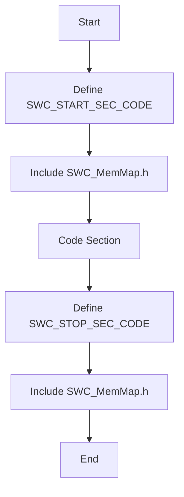
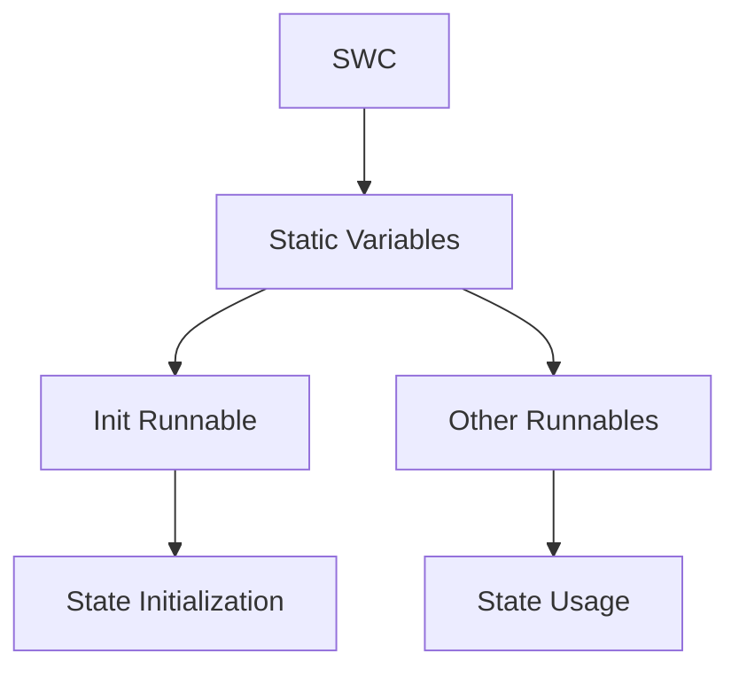
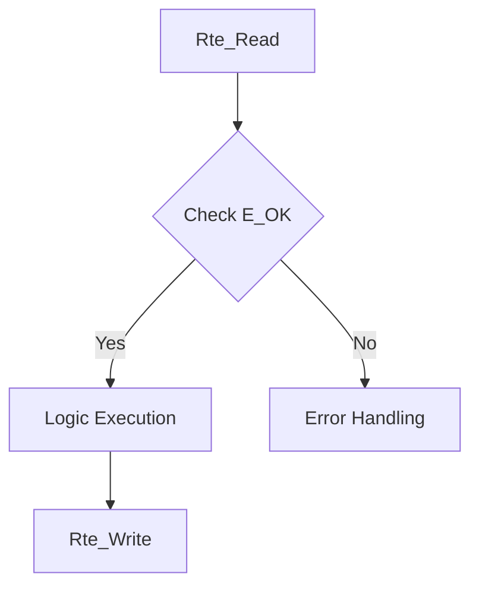

# Traceability Matrix

| Source File | Source Function | AUTOSAR File | AUTOSAR Function | Status |
|---|---|---|---|---|
| command_parser.c | command_parser_get_latest | command_parser.c | CommandParser_GetLatest | Implemented |
| command_parser.c | command_parser_init | command_parser.c | CommandParser_Init | Implemented |
| command_parser.c | command_parser_process_byte | command_parser.c | CommandParser_ProcessByte | Implemented |
| feedback_processor.c | feedback_processor_get | feedback_processor.c | FeedbackProcessor_Get | Implemented |
| feedback_processor.c | feedback_processor_init | feedback_processor.c | FeedbackProcessor_Init | Implemented |
| feedback_processor.c | feedback_processor_update | feedback_processor.c | FeedbackProcessor_Update | Implemented |
| flap_control.c | flap_control_init | flap_control.c | FlapControl_Init | Implemented |
| flap_control.c | flap_control_update | flap_control.c | FlapControl_Update | Implemented |
| led_status.c | led_status_error | led_status.c | LedStatus_Error | Implemented |
| led_status.c | led_status_init | led_status.c | LedStatus_Init | Implemented |
| led_status.c | led_status_power_ok | led_status.c | LedStatus_PowerOk | Implemented |
| led_status.c | led_status_set_position | led_status.c | LedStatus_SetPosition | Implemented |
| motor_driver.c | motor_drive | motor_driver.c | MotorDriver_Drive | Implemented |
| motor_driver.c | motor_driver_init | motor_driver.c | MotorDriver_Init | Implemented |
| motor_driver.c | motor_driver_status | motor_driver.c | MotorDriver_Status | Implemented |
| motor_driver.c | motor_stop | motor_driver.c | MotorDriver_Stop | Implemented |

# Compliance Analysis

The generated code adheres to AUTOSAR and MISRA-C standards by implementing the following:

1. **Data Types**: The code uses `Std_Types.h` and `Platform_Types.h` for standard data types, ensuring compliance with AUTOSAR's type definitions.
2. **Compiler Abstraction**: AUTOSAR compiler abstraction macros are used for function definitions and pointers, ensuring portability and consistency across different compilers.
3. **Memory Mapping**: Each file uses memory sections for code and constants, with `MemMap.h` included to manage memory mapping, ensuring proper placement of code and data.
4. **RTE API Robustness**: All RTE API calls return `Std_ReturnType`, and the return values are checked for `E_OK` before using the data, ensuring robustness and error handling.
5. **Functional Logic Porting & SWC Isolation**: The logic from the source code is re-implemented within the AUTOSAR Runnables, with static variables used for state management, ensuring SWC isolation and compliance with AUTOSAR's component model.
6. **Architecture & Initialization**: Each SWC has its own initialization runnable, and cross-SWC communication is handled via Rte_Read/Rte_Write, adhering to AUTOSAR's decentralized initialization and communication model.
7. **Detailed Compliance Refine**: Pointer validation is performed in all functions, and constants are defined using appropriate memory sections. Version macros are included in each header file.
8. **Naming Alignment**: The generated files use the exact same names as the source files, ensuring consistency and traceability.

# Compliance Diagrams

## Memory Mapping

## SWC Isolation

## Safety Patterns

