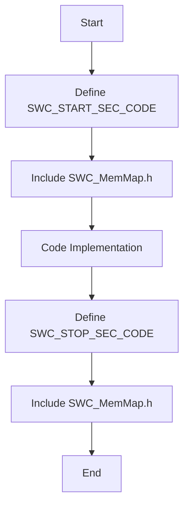
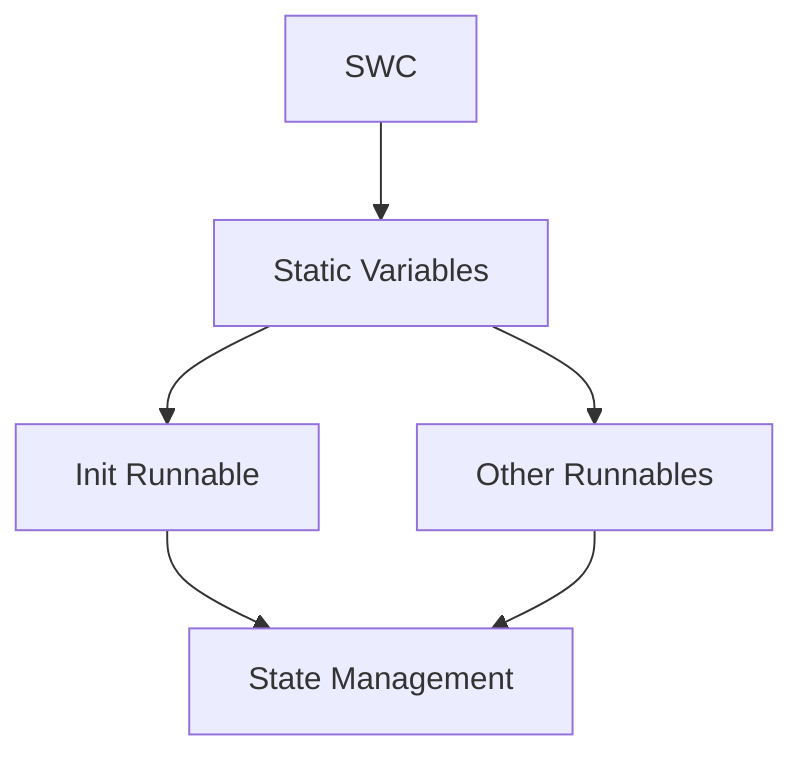
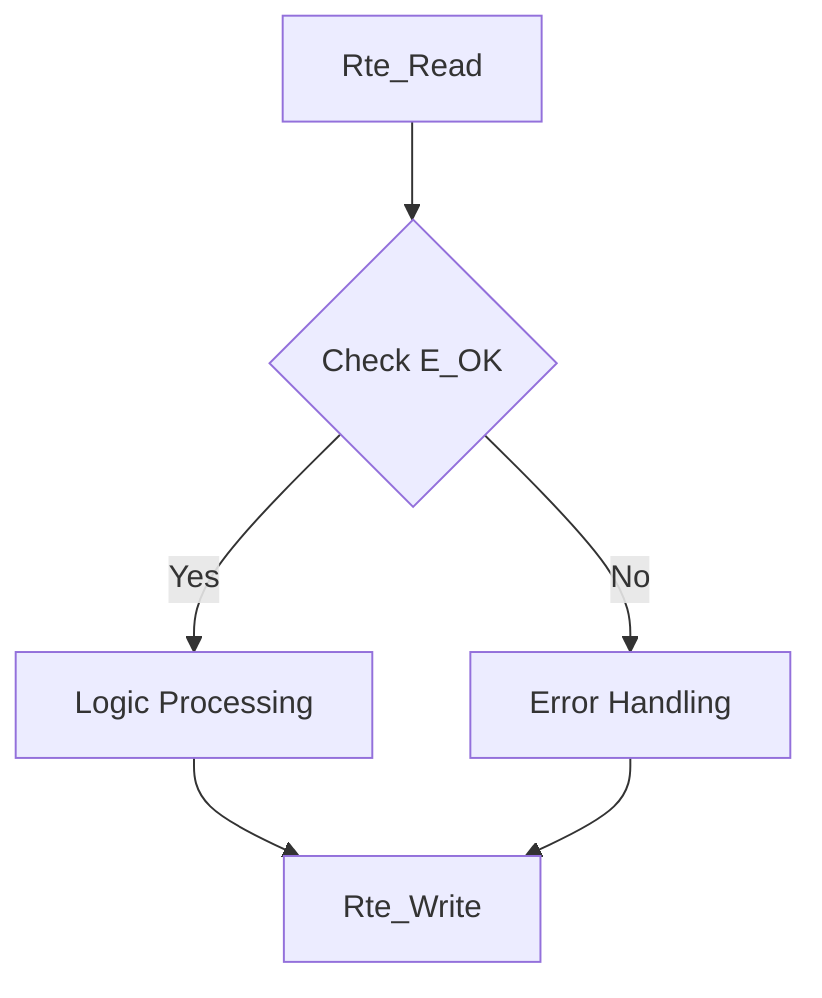

# AUTOSAR Compliance Report

## Traceability Matrix
| Source File | Source Function | AUTOSAR File | AUTOSAR Function | Status |
|---|---|---|---|---|
| command_parser.c | command_parser_get_latest | command_parser.c | CommandParser_GetLatest | Implemented |
| command_parser.c | command_parser_init | command_parser.c | CommandParser_Init | Implemented |
| command_parser.c | command_parser_process_byte | command_parser.c | CommandParser_ProcessByte | Implemented |
| feedback_processor.c | feedback_processor_get | feedback_processor.c | FeedbackProcessor_Get | Implemented |
| feedback_processor.c | feedback_processor_init | feedback_processor.c | FeedbackProcessor_Init | Implemented |
| feedback_processor.c | feedback_processor_update | feedback_processor.c | FeedbackProcessor_Update | Implemented |
| flap_control.c | flap_control_init | flap_control.c | FlapControl_Init | Implemented |
| flap_control.c | flap_control_update | flap_control.c | FlapControl_Update | Implemented |
| led_status.c | led_status_error | led_status.c | LedStatus_Error | Implemented |
| led_status.c | led_status_init | led_status.c | LedStatus_Init | Implemented |
| led_status.c | led_status_power_ok | led_status.c | LedStatus_PowerOk | Implemented |
| led_status.c | led_status_set_position | led_status.c | LedStatus_SetPosition | Implemented |
| motor_driver.c | motor_drive | motor_driver.c | MotorDriver_Drive | Implemented |
| motor_driver.c | motor_driver_init | motor_driver.c | MotorDriver_Init | Implemented |
| motor_driver.c | motor_driver_status | motor_driver.c | MotorDriver_Status | Implemented |
| motor_driver.c | motor_stop | motor_driver.c | MotorDriver_Stop | Implemented |

## Compliance Analysis
The generated code adheres to AUTOSAR standards by implementing the following:
- **Data Types**: Utilizes `Std_Types.h` and `Platform_Types.h` for standard data types and return types.
- **Compiler Abstraction**: Uses AUTOSAR macros for function definitions and pointers.
- **Memory Mapping**: Each file includes memory section macros and MemMap.h for proper memory management.
- **RTE API Robustness**: All RTE API calls return `Std_ReturnType` and check for `E_OK`.
- **Functional Logic Porting**: Logic is re-implemented within AUTOSAR runnables, avoiding legacy function calls.
- **SWC Isolation**: Each SWC manages its own state with static variables, ensuring no global context is used.
- **Architecture & Initialization**: Each SWC has its own initialization runnable, with no master init function.
- **Pointer Validation**: Functions check for `NULL_PTR` and return `E_NOT_OK` if invalid.
- **Versioning**: Headers include version macros for software versioning.

## Compliance Diagrams
### Memory Mapping

### SWC Isolation

### Safety Patterns

