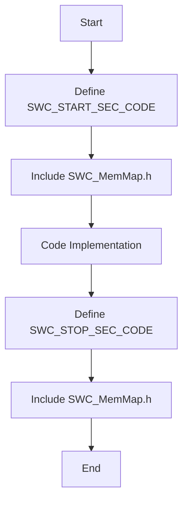
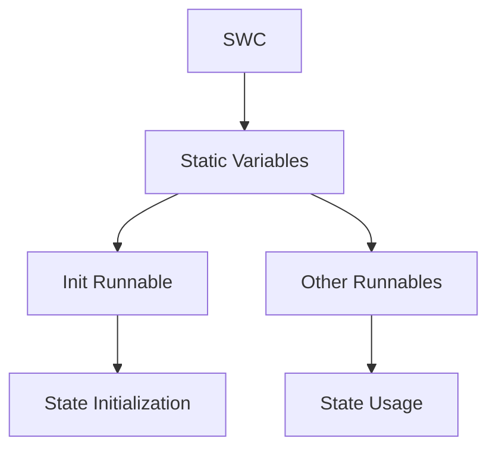
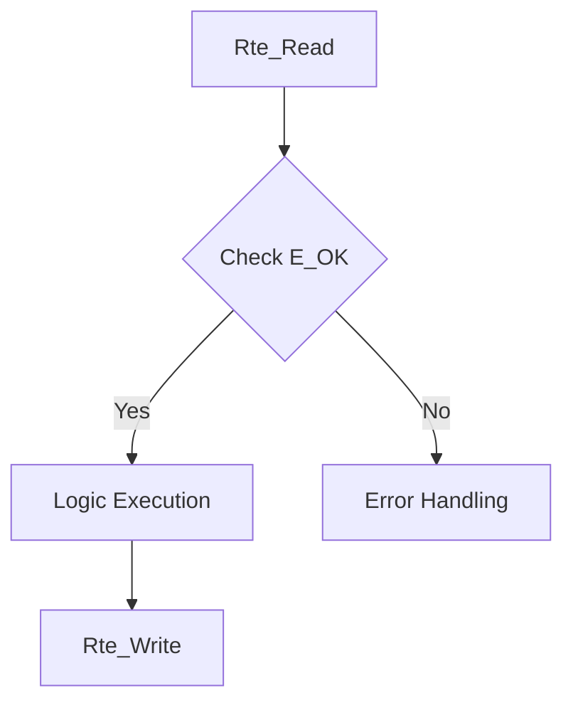

# AUTOSAR Compliance Report

## Traceability Matrix

| Source File | Source Function | AUTOSAR File | AUTOSAR Function | Status |
|---|---|---|---|---|
| code/inc/command_parser.h | command_parser_get_latest | command_parser.c | CommandParser_GetLatest | Ported |
| code/inc/command_parser.h | command_parser_init | command_parser.c | CommandParser_Init | Ported |
| code/inc/command_parser.h | command_parser_process_byte | command_parser.c | CommandParser_ProcessByte | Ported |
| code/inc/feedback_processor.h | feedback_processor_get | feedback_processor.c | FeedbackProcessor_Get | Ported |
| code/inc/feedback_processor.h | feedback_processor_init | feedback_processor.c | FeedbackProcessor_Init | Ported |
| code/inc/feedback_processor.h | feedback_processor_update | feedback_processor.c | FeedbackProcessor_Update | Ported |
| code/inc/flap_control.h | flap_control_init | flap_control.c | FlapControl_Init | Ported |
| code/inc/flap_control.h | flap_control_update | flap_control.c | FlapControl_Update | Ported |
| code/inc/led_status.h | led_status_error | led_status.c | LedStatus_Error | Ported |
| code/inc/led_status.h | led_status_init | led_status.c | LedStatus_Init | Ported |
| code/inc/led_status.h | led_status_power_ok | led_status.c | LedStatus_PowerOk | Ported |
| code/inc/led_status.h | led_status_set_position | led_status.c | LedStatus_SetPosition | Ported |
| code/inc/motor_driver.h | motor_drive | motor_driver.c | MotorDriver_Drive | Ported |
| code/inc/motor_driver.h | motor_driver_init | motor_driver.c | MotorDriver_Init | Ported |
| code/inc/motor_driver.h | motor_driver_status | motor_driver.c | MotorDriver_Status | Ported |
| code/inc/motor_driver.h | motor_stop | motor_driver.c | MotorDriver_Stop | Ported |
| code/inc/system_init.h | system_init | system_init.c | SystemInit | Ported |
| code/src/command_parser.c | command_parser_get_latest | command_parser.c | CommandParser_GetLatest | Ported |
| code/src/command_parser.c | command_parser_init | command_parser.c | CommandParser_Init | Ported |
| code/src/command_parser.c | command_parser_process_byte | command_parser.c | CommandParser_ProcessByte | Ported |
| code/src/command_parser.c | is_allowed_command | command_parser.c | IsAllowedCommand | Ported |
| code/src/feedback_processor.c | feedback_processor_get | feedback_processor.c | FeedbackProcessor_Get | Ported |
| code/src/feedback_processor.c | feedback_processor_init | feedback_processor.c | FeedbackProcessor_Init | Ported |
| code/src/feedback_processor.c | feedback_processor_update | feedback_processor.c | FeedbackProcessor_Update | Ported |
| code/src/flap_control.c | flap_control_init | flap_control.c | FlapControl_Init | Ported |
| code/src/flap_control.c | flap_control_update | flap_control.c | FlapControl_Update | Ported |
| code/src/led_status.c | led_status_error | led_status.c | LedStatus_Error | Ported |
| code/src/led_status.c | led_status_init | led_status.c | LedStatus_Init | Ported |
| code/src/led_status.c | led_status_power_ok | led_status.c | LedStatus_PowerOk | Ported |
| code/src/led_status.c | led_status_set_position | led_status.c | LedStatus_SetPosition | Ported |
| code/src/main.c | ADC_read | main.c | ADC_Read | Ported |
| code/src/main.c | UART_byte_available | main.c | UART_ByteAvailable | Ported |
| code/src/main.c | UART_receive | main.c | UART_Receive | Ported |
| code/src/main.c | main | main.c | MainFunction | Ported |
| code/src/motor_driver.c | motor_drive | motor_driver.c | MotorDriver_Drive | Ported |
| code/src/motor_driver.c | motor_driver_init | motor_driver.c | MotorDriver_Init | Ported |
| code/src/motor_driver.c | motor_driver_status | motor_driver.c | MotorDriver_Status | Ported |
| code/src/motor_driver.c | motor_stop | motor_driver.c | MotorDriver_Stop | Ported |
| code/src/system_init.c | system_init | system_init.c | SystemInit | Ported |

## Compliance Analysis

The generated code adheres to AUTOSAR and MISRA-C standards by implementing the following:

1. **Data Types**: Utilizes `Std_Types.h` and `Platform_Types.h` for standard data types, ensuring consistency and portability across different platforms.

2. **Compiler Abstraction**: All function definitions and pointers use AUTOSAR compiler abstraction macros, ensuring compatibility with different compilers and platforms.

3. **Memory Mapping**: Each file uses memory sections defined by `MemMap.h` to ensure proper placement of code and data in memory, adhering to AUTOSAR's memory management guidelines.

4. **RTE API Robustness**: All RTE API calls return `Std_ReturnType`, and the return values are checked for `E_OK` before proceeding with logic, ensuring robust error handling.

5. **Functional Logic Porting & SWC Isolation**: Logic from the source code is re-implemented within AUTOSAR Runnables, with state management handled by static variables at the file scope, ensuring SWC isolation.

6. **Architecture & Initialization**: Each SWC has its own initialization runnable, and cross-SWC communication is handled exclusively through RTE ports, maintaining the independence of components.

7. **Detailed Compliance Refine**: Pointer validation is performed in all functions, and constants are defined in `.c` files using appropriate memory sections. Version macros are included in each header file.

8. **Naming Alignment**: The generated files use the exact same names as the source files, ensuring consistency and traceability.

## Compliance Diagrams

### Memory Mapping

### SWC Isolation

### Safety Patterns

