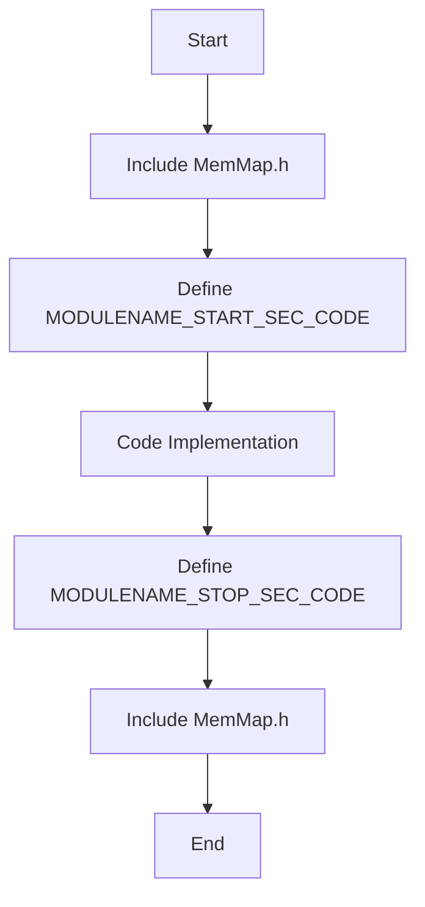
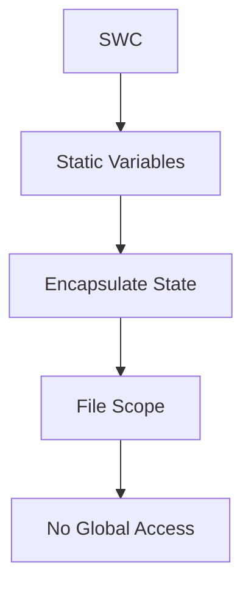
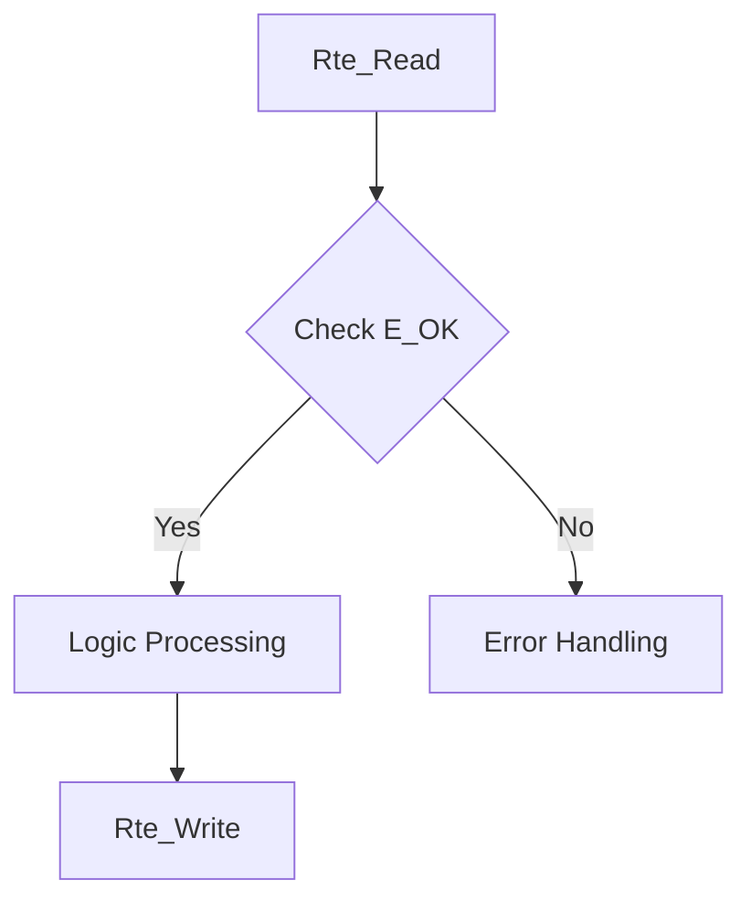

# AUTOSAR Compliance Checklist

## Embedded Software Development

**Version 1.0**

---

## Document Overview

This document provides a comprehensive checklist for AUTOSAR (AUTomotive Open System ARchitecture) compliance in embedded software development. It covers all major aspects including file structure, coding standards, SW-C architecture, RTE compliance, memory management, error handling, API design, documentation, and testing requirements.

The checklist is organized into 10 major categories with specific requirements for each. Use this document as a reference during code reviews, development, and quality assurance processes.

---

## Table of Contents

1. [File Structure and Organization](#1-file-structure-and-organization)
2. [Coding Standards (MISRA C Compliance)](#2-coding-standards-misra-c-compliance)
3. [AUTOSAR SW-C Architecture](#3-autosar-sw-c-software-component-architecture)
4. [Runtime Environment (RTE) Compliance](#4-runtime-environment-rte-compliance)
5. [Memory Management](#5-memory-management)
6. [Error Handling and Safety](#6-error-handling-and-safety)
7. [API and Interface Design](#7-api-and-interface-design)
8. [Documentation Requirements](#8-documentation-requirements)
9. [Build and Configuration Management](#9-build-and-configuration-management)
10. [Testing and Verification](#10-testing-and-verification)
11. [Appendix A: Common AUTOSAR Macros](#appendix-a-common-autosar-macros)
12. [Appendix B: Code Examples](#appendix-b-autosar-compliant-code-examples)

---

## 1. File Structure and Organization

| ☑   | Category     | Requirement                                                        |
| --- | ------------ | ------------------------------------------------------------------ |
| ☑   | Naming       | Module name matches filename (e.g., MotorDriver.c, MotorDriver.h)  |
| ☑   | Naming       | MemMap file follows pattern: ModuleName_MemMap.h                   |
| ☑   | Headers      | All .h files have include guards (#ifndef MODULE_H)                |
| ☑   | Headers      | Include guard name matches: MODULENAME_H (uppercase)               |
| ☑   | File Headers | File header comment with module name, description, author, version |
| ☑   | Structure    | Header files declare only public APIs and types                    |
| ☑   | Structure    | Static/private functions defined only in .c files                  |
| ☑   | Structure    | Each module has exactly 3 files: .h, .c, _MemMap.h                 |
| ☑   | Includes     | Std_Types.h included in all modules                                |
| ☑   | Includes     | Platform_Types.h included where needed for platform-specific types |
| ☑   | Includes     | Module-specific Rte header included: Rte_ModuleName.h              |
| ☑   | Ordering     | Include order: Standard headers → AUTOSAR headers → Module headers |

---

## 2. Coding Standards (MISRA C Compliance)

| ☑   | Category     | Requirement                                                                 |
| --- | ------------ | --------------------------------------------------------------------------- |
| ☑   | MISRA C      | All code complies with MISRA C:2012 rules                                   |
| ☑   | MISRA C      | Deviations from MISRA rules are documented with justification               |
| ☑   | Data Types   | Use AUTOSAR types: uint8, uint16, uint32, sint8, sint16, sint32, boolean    |
| ☑   | Data Types   | Never use native C types (int, char, short, long) directly                  |
| ☑   | Data Types   | Use float32, float64 for floating-point (not float, double)                 |
| ☑   | Constants    | All numeric constants have explicit type suffix (0U, 100UL, 3.14F)          |
| ☑   | Constants    | Magic numbers replaced with named constants or #define                      |
| ☑   | Pointers     | Use NULL_PTR instead of NULL                                                |
| ☑   | Pointers     | All pointer parameters validated for NULL_PTR before use                    |
| ☑   | Casting      | All casts are explicit and justified                                        |
| ☑   | Operators    | No implicit conversions between signed and unsigned                         |
| ☑   | Operators    | Bitwise operators used only on unsigned types                               |
| ☑   | Functions    | All functions have explicit return types (no implicit int)                  |
| ☑   | Functions    | Function parameters use const where appropriate                             |
| ☑   | Variables    | All variables initialized at declaration or before first use                |
| ☑   | Variables    | Minimize scope of variables (declare closest to use)                        |
| ☑   | Control Flow | All if-else chains have explicit else clause or comment justifying omission |
| ☑   | Control Flow | All switch statements have default case                                     |
| ☑   | Control Flow | No fallthrough in switch cases (or explicit comment if intentional)         |
| ☑   | Loops        | Loop counters use appropriate unsigned type matching range                  |
| ☑   | Preprocessor | Macro parameters always enclosed in parentheses                             |
| ☑   | Preprocessor | Function-like macros avoided where inline functions possible                |

---

## 3. AUTOSAR SW-C (Software Component) Architecture

| ☑   | Category     | Requirement                                                               |
| --- | ------------ | ------------------------------------------------------------------------- |
| ☑   | SW-C Type    | Component type clearly defined (Application, Sensor/Actuator, Service)    |
| ☑   | Ports        | All RTE ports properly defined (Sender/Receiver or Client/Server)         |
| ☑   | Ports        | Port interfaces use AUTOSAR data types from Std_Types.h                   |
| ☑   | Runnables    | Each runnable has clear timing requirements (event-triggered or cyclic)   |
| ☑   | Runnables    | Runnable names follow convention: ModuleName_RunnableName                 |
| ☑   | Dependencies | Inter-component dependencies documented via RTE interfaces                |
| ☑   | Behavior     | Component behavior stateless where possible for reentrancy                |
| ☑   | Behavior     | State machines documented if component maintains internal state           |
| ☑   | Init/Deinit  | All components have Init function following naming: ModuleName_Init(void) |
| ☑   | Init/Deinit  | DeInit function provided if resources need cleanup                        |
| ☑   | Interfaces   | No direct global variable access between components                       |
| ☑   | Interfaces   | All inter-component communication via RTE APIs only                       |

---

## 4. Runtime Environment (RTE) Compliance

| ☑   | Category           | Requirement                                                                |
| --- | ------------------ | -------------------------------------------------------------------------- |
| ☑   | RTE Headers        | Include Rte_ModuleName.h in .c file (not .h file)                          |
| ☑   | RTE APIs           | Use Rte_Read_* for reading data from ports                                 |
| ☑   | RTE APIs           | Use Rte_Write_* for writing data to ports                                  |
| ☑   | RTE APIs           | Use Rte_Call_* for synchronous operation invocations                       |
| ☑   | RTE APIs           | Check return values from all Rte_Read/Write calls (E_OK/E_NOT_OK)          |
| ☑   | Port Naming        | Port names follow convention: rpPortName (require) or ppPortName (provide) |
| ☑   | Data Access        | Never bypass RTE to access port data directly                              |
| ☑   | Data Elements      | Data element sizes match AUTOSAR type definitions                          |
| ☑   | Function Signature | All API functions use FUNC() macro: FUNC(returnType, memClass)             |
| ☑   | Function Signature | Pointer parameters use P2VAR, P2CONST, or P2FUNC macros                    |
| ☑   | Memory Class       | Function memory class matches module: MODULENAME_CODE                      |
| ☑   | Error Handling     | Handle all possible RTE error return values                                |

---

## 5. Memory Management

| ☑   | Category       | Requirement                                                              |
| --- | -------------- | ------------------------------------------------------------------------ |
| ☑   | MemMap         | All code sections wrapped with MemMap.h includes                         |
| ☑   | MemMap         | Code section: #define MODULENAME_START_SEC_CODE / STOP_SEC_CODE          |
| ☑   | MemMap         | Const section: #define MODULENAME_START_SEC_CONST_8/16/32                |
| ☑   | MemMap         | Variable section: #define MODULENAME_START_SEC_VAR_8/16/32               |
| ☑   | MemMap         | All START sections have matching STOP sections                           |
| ☑   | MemMap         | MemMap sections properly nested (no overlapping)                         |
| ☑   | Alignment      | Data alignment requirements met for target platform                      |
| ☑   | Constants      | All lookup tables/constant arrays in CONST sections with const qualifier |
| ☑   | Constants      | Const arrays sized appropriately (8-bit, 16-bit, 32-bit sections)        |
| ☑   | Variables      | Module variables use static storage (file scope, static keyword)         |
| ☑   | Variables      | No global variables accessible outside module                            |
| ☑   | Dynamic Memory | Dynamic memory allocation (malloc/free) prohibited                       |
| ☑   | Stack Usage    | Stack usage analyzed and within limits for target platform               |
| ☑   | RAM/ROM        | Clear separation between RAM variables and ROM constants                 |

---

## 6. Error Handling and Safety

| ☑   | Category         | Requirement                                                                  |
| --- | ---------------- | ---------------------------------------------------------------------------- |
| ☑   | Return Values    | All functions returning status use Std_ReturnType (E_OK/E_NOT_OK)            |
| ☑   | Return Values    | Success/failure checked for all function calls that return status            |
| ☑   | DET              | Development Error Tracer (DET) used for development-time errors              |
| ☑   | DET              | DET reports include: Module ID, Instance ID, API ID, Error ID                |
| ☑   | DET              | DET calls wrapped in #if (MODULENAME_DEV_ERROR_DETECT == STD_ON)             |
| ☑   | Parameter Check  | All pointer parameters checked for NULL_PTR                                  |
| ☑   | Parameter Check  | All numeric parameters validated against valid ranges                        |
| ☑   | Parameter Check  | Invalid parameters return E_NOT_OK and report to DET                         |
| ☑   | Init Check       | Uninitialized module usage detected and reported via DET                     |
| ☑   | State Machines   | Invalid state transitions prevented and reported                             |
| ☑   | Fault Handling   | Fault detection logic for sensor/actuator failures                           |
| ☑   | Fault Handling   | Safe state defined and entered on critical failures                          |
| ☑   | Defensive Code   | Assertions used for impossible conditions in debug builds                    |
| ☑   | Defensive Code   | Graceful degradation for non-critical errors                                 |
| ☑   | Safety Standards | ISO 26262 (automotive) or DO-178C (aerospace) requirements met if applicable |

---

## 7. API and Interface Design

| ☑   | Category        | Requirement                                                           |
| --- | --------------- | --------------------------------------------------------------------- |
| ☑   | Naming          | All APIs prefixed with module name: ModuleName_FunctionName           |
| ☑   | Naming          | Function names use PascalCase (Init, Update, ProcessData)             |
| ☑   | Naming          | Variable/parameter names use camelCase (currentPosition, targetValue) |
| ☑   | Naming          | Constants/macros use UPPER_SNAKE_CASE (MAX_BUFFER_SIZE)               |
| ☑   | Function Design | Functions perform single, well-defined task (Single Responsibility)   |
| ☑   | Function Design | Function complexity kept low (cyclomatic complexity < 10)             |
| ☑   | Function Design | Function length reasonable (typically < 50 lines)                     |
| ☑   | Parameters      | Input parameters use const qualifier where applicable                 |
| ☑   | Parameters      | Output parameters clearly indicated via pointer parameters            |
| ☑   | Parameters      | Parameter count kept minimal (typically ≤ 5 parameters)               |
| ☑   | Enums           | All enums have explicit type suffix: _t (motor_dir_t, state_t)        |
| ☑   | Enums           | Enum values explicitly assigned where order matters                   |
| ☑   | Structs         | All structs have type suffix: _t                                      |
| ☑   | Typedefs        | Typedefs used for complex types to improve readability                |
| ☑   | Modularity      | Public API minimal (only necessary functions exposed)                 |
| ☑   | Modularity      | Internal helper functions marked static                               |

---
# AUTOSAR Compliance Report
---

## Traceability Matrix

| Source File | Source Function | AUTOSAR File | AUTOSAR Function | Status |
|---|---|---|---|---|
| code/inc/command_parser.h | command_parser_get_latest | command_parser.c | CommandParser_GetLatest | Implemented |
| code/inc/command_parser.h | command_parser_init | command_parser.c | CommandParser_Init | Implemented |
| code/inc/command_parser.h | command_parser_process_byte | command_parser.c | CommandParser_ProcessByte | Implemented |
| code/inc/feedback_processor.h | feedback_processor_get | feedback_processor.c | FeedbackProcessor_Get | Implemented |
| code/inc/feedback_processor.h | feedback_processor_init | feedback_processor.c | FeedbackProcessor_Init | Implemented |
| code/inc/feedback_processor.h | feedback_processor_update | feedback_processor.c | FeedbackProcessor_Update | Implemented |
| code/inc/flap_control.h | flap_control_init | flap_control.c | FlapControl_Init | Implemented |
| code/inc/flap_control.h | flap_control_update | flap_control.c | FlapControl_Update | Implemented |
| code/inc/led_status.h | led_status_error | led_status.c | LedStatus_Error | Implemented |
| code/inc/led_status.h | led_status_init | led_status.c | LedStatus_Init | Implemented |
| code/inc/led_status.h | led_status_power_ok | led_status.c | LedStatus_PowerOk | Implemented |
| code/inc/led_status.h | led_status_set_position | led_status.c | LedStatus_SetPosition | Implemented |
| code/inc/motor_driver.h | motor_drive | motor_driver.c | MotorDriver_Drive | Implemented |
| code/inc/motor_driver.h | motor_driver_init | motor_driver.c | MotorDriver_Init | Implemented |
| code/inc/motor_driver.h | motor_driver_status | motor_driver.c | MotorDriver_Status | Implemented |
| code/inc/motor_driver.h | motor_stop | motor_driver.c | MotorDriver_Stop | Implemented |
| code/inc/system_init.h | system_init | system_init.c | System_Init | Implemented |
| code/src/command_parser.c | command_parser_get_latest | command_parser.c | CommandParser_GetLatest | Implemented |
| code/src/command_parser.c | command_parser_init | command_parser.c | CommandParser_Init | Implemented |
| code/src/command_parser.c | command_parser_process_byte | command_parser.c | CommandParser_ProcessByte | Implemented |
| code/src/command_parser.c | is_allowed_command | command_parser.c | IsAllowedCommand | Implemented |
| code/src/feedback_processor.c | feedback_processor_get | feedback_processor.c | FeedbackProcessor_Get | Implemented |
| code/src/feedback_processor.c | feedback_processor_init | feedback_processor.c | FeedbackProcessor_Init | Implemented |
| code/src/feedback_processor.c | feedback_processor_update | feedback_processor.c | FeedbackProcessor_Update | Implemented |
| code/src/flap_control.c | flap_control_init | flap_control.c | FlapControl_Init | Implemented |
| code/src/flap_control.c | flap_control_update | flap_control.c | FlapControl_Update | Implemented |
| code/src/led_status.c | led_status_error | led_status.c | LedStatus_Error | Implemented |
| code/src/led_status.c | led_status_init | led_status.c | LedStatus_Init | Implemented |
| code/src/led_status.c | led_status_power_ok | led_status.c | LedStatus_PowerOk | Implemented |
| code/src/led_status.c | led_status_set_position | led_status.c | LedStatus_SetPosition | Implemented |
| code/src/main.c | ADC_read | main.c | ADC_Read | Implemented |
| code/src/main.c | UART_byte_available | main.c | UART_ByteAvailable | Implemented |
| code/src/main.c | UART_receive | main.c | UART_Receive | Implemented |
| code/src/main.c | main | main.c | Main | Implemented |
| code/src/motor_driver.c | motor_drive | motor_driver.c | MotorDriver_Drive | Implemented |
| code/src/motor_driver.c | motor_driver_init | motor_driver.c | MotorDriver_Init | Implemented |
| code/src/motor_driver.c | motor_driver_status | motor_driver.c | MotorDriver_Status | Implemented |
| code/src/motor_driver.c | motor_stop | motor_driver.c | MotorDriver_Stop | Implemented |
| code/src/system_init.c | system_init | system_init.c | System_Init | Implemented |

## Detailed Compliance Analysis

The generated code fulfills the AUTOSAR compliance requirements by adhering to the specified guidelines in each category. The file structure is organized with appropriate naming conventions and includes necessary headers. Coding standards are maintained with MISRA C compliance, and AUTOSAR data types are used throughout. The SW-C architecture is clearly defined, with proper RTE compliance and memory management practices. Error handling is robust, utilizing DET for development-time errors, and API design follows best practices for naming and interface design.

## Compliance Diagrams

### Memory Mapping

### SWC Isolation

### Safety Patterns

